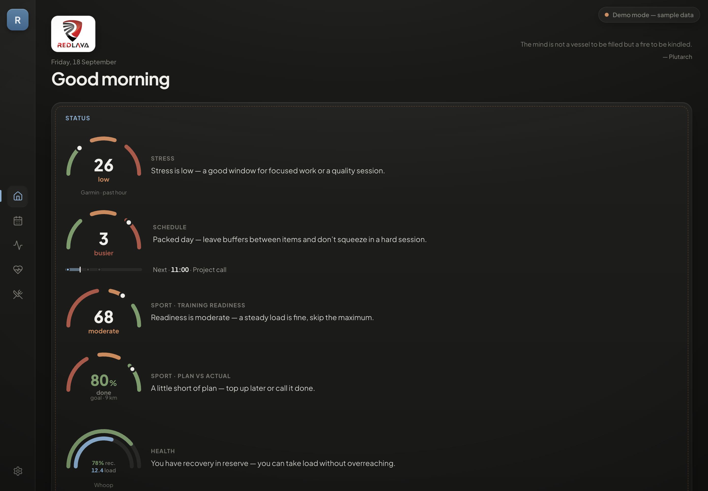
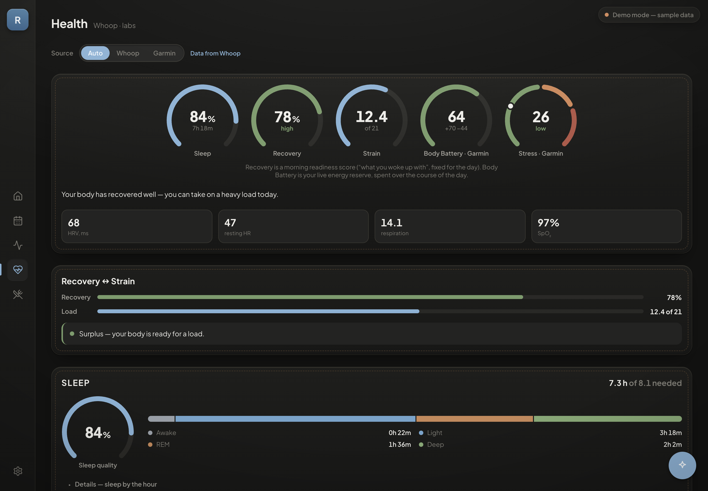
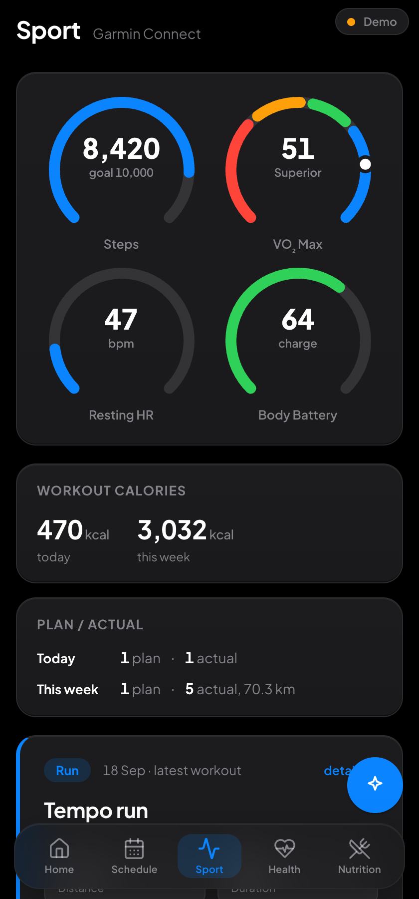
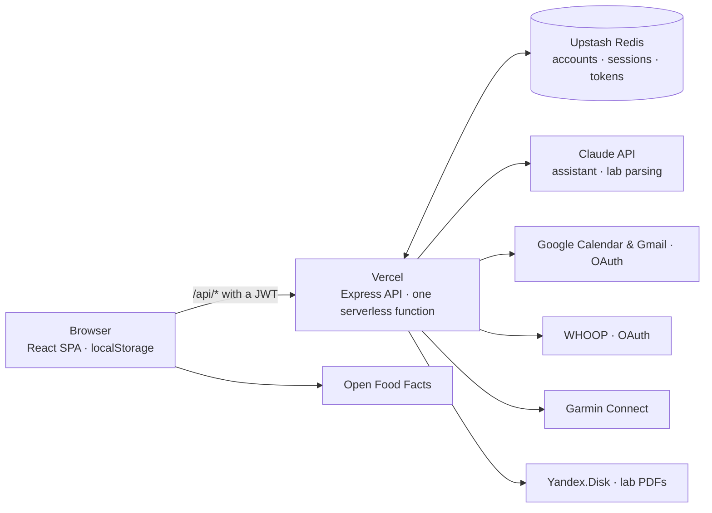

# RedLava

[](https://github.com/Samitovamir/RedLava/actions/workflows/codeql.yml)
[](https://github.com/Samitovamir/RedLava/actions/workflows/gitleaks.yml)
[](https://github.com/Samitovamir/RedLava/actions/workflows/lint.yml)

A training and health dashboard for a triathlon club. Garmin, WHOOP, Google Calendar and
blood tests in one place, with an AI assistant that works from the athlete's own data and can
act on it: create calendar events, draft emails, remember facts.

**Live demo:** https://redlava-demo-website.vercel.app — sign in as `guest` / `123` to browse
sample data.

> Built for a real user, an amateur triathlete who was checking four different apps every
> morning. It has been in daily use since June 2026 and now has accounts for the club.



<p align="center">
  
  
</p>

<sup>Screenshots show the guest demo: sample data, not anyone's real health records.</sup>

---

## What it does

| Area | What's there |
|---|---|
| **Status** | One card that reads every area at once: stress, schedule load, training readiness, plan vs actual, recovery vs strain, nutrition. Each has a personal AI recommendation and a plain fallback when the AI is unavailable. |
| **Schedule** | Two-way Google Calendar sync. The assistant can create, move and delete events. |
| **Sport** | Garmin Connect: workouts with per-kilometre splits, GPS track, heart-rate, elevation and power charts; training status, load (ACWR), HRV, race predictions, lactate threshold. |
| **Health** | WHOOP recovery, sleep and strain. Blood tests uploaded as PDF or photo are read by Claude vision into ~76 known markers and tracked over time against reference ranges. |
| **Nutrition** | Photo food diary, barcode scanning (Open Food Facts), calorie and macro targets from a short survey, FODMAP flags. |
| **Assistant** | Claude with tool use: eight real tools (`create_event`, `send_email`, `remember_fact`, `route_eta`, …). It works from a snapshot of the member's whole dashboard, so answers rest on their actual data. |

## Architecture



```
frontend/  React 18 + Vite SPA
  ├─ ui/         design-system primitives, including the one chart kit (Gauge, Meters, RangeBar)
  ├─ components/ screens' building blocks
  ├─ context/    events, history, memory, language
  └─ utils/      domain logic kept out of components (labs, nutrition, whoop, scales)

backend/   Express, deployed as a single Vercel serverless function (api/index.js)
  ├─ routes/     one module per integration: calendar, gmail, garmin, whoop, labs,
  │              nutrition, sync, history, ai, auth
  └─ authGuard.js, userScope.js, rateLimit.js — sessions, per-account keys, attempt limits

tests/     Puppeteer browser tests against a throwaway copy of the app
```

**Notable bits**

- **Token rotation under concurrency.** WHOOP issues single-use refresh tokens. Parallel
  serverless invocations racing to refresh would invalidate each other, so refreshes are
  serialised behind a KV lock and the new pair is written in one fenced operation.
- **Revocable stateless sessions.** A JWT normally can't be taken back. Each token carries a
  per-account session epoch, so "sign out my other devices" or a password change ends one
  person's sessions and nobody else's, for the price of one key read per request.
- **The AI's system prompt is the server's alone.** Dashboard data, which includes text other
  people wrote (calendar invites, emails), reaches the model as labelled data in the user turn,
  and moving or deleting events needs a human tap.
- **Google OAuth in "Testing" mode expires refresh tokens every 7 days.** The backend detects
  `invalid_grant`, marks the token dead instead of retrying forever, and shows a reconnect banner.
- **AI cost guard.** One dashboard load fans out to 10–15 AI cards, so there are request-rate
  fuses, a message size cap and daily allowances per guest device and per account.
- **Design system.** Themes are driven entirely by CSS custom properties (four on desktop, a
  light and a dark one on phones); components never hard-code a colour, and every chart goes
  through the same three components.
- **Bilingual (EN/RU).** The first visit follows the browser locale; the server answers in the
  same language.

## Security

Passwords are bcrypt-hashed and registration is invite-only. Changing a password needs the
current one and signs out every other device. Sessions are signed, pinned-algorithm JWTs with a
per-account revocation epoch, and every stored key carries its owner's id, so one account cannot
reach another's data. Sign-in, registration, password change and Garmin connect are rate-limited
through the KV store, which works across serverless instances. The page is served with a CSP
that allows its two inline scripts by SHA-256 hash, with no `unsafe-inline`.

Every push runs **CodeQL**, a **gitleaks** scan over the full history and **ESLint**. The first
CodeQL run found 12 alerts: eight were fixed (among them a path injection into Google Calendar
URLs and client text reaching the AI system prompt) and four are accepted with reasons.
The threat model, the accepted risks and that triage are in [SECURITY.md](SECURITY.md).

## Stack

React 18 · Vite · React Router · Framer Motion · Express · Vercel serverless · Upstash Redis ·
Claude API (`@anthropic-ai/sdk`) · Google Calendar & Gmail APIs · Garmin Connect · WHOOP API ·
Yandex.Disk · Puppeteer · ESLint

## Running locally

```bash
cp .env.example .env         # at least JWT_SECRET (openssl rand -base64 48); .env is gitignored
npm install                  # root: tests and lint
cd backend  && npm install && npm run dev    # http://localhost:3001
cd frontend && npm install && npm run dev    # http://localhost:5173
```

`./start.sh` starts both. The frontend proxies `/api/*` to the backend in dev. Without an
`ANTHROPIC_API_KEY` everything still renders; the AI cards fall back to plain text. The guest
login works locally too (`guest` / `123` by default).

## Tests

```bash
npm test        # 13 browser tests, ~1.5 minutes
npm run lint
```

`npm test` starts its own copy of the backend and frontend on separate ports, with an empty
store and a random signing secret, so it never touches your data and needs no API keys. It
checks that every screen renders without console errors in both languages, that one account
cannot read another's data, that "sign out other devices" only affects its own account, that a
password change needs the current password and ends the other sessions, and the sign-up edge
cases (duplicate names in any case, out-of-range survey values).

## Notes

- Blood-test marker names are stored in Russian because they double as matching keys when
  parsing Russian lab PDFs; English display names sit alongside them (`nameEn`).
- The AI prompts are written in Russian on purpose: the club is Russian-speaking and they steer
  the model rather than being shown to anyone. The reply language follows the interface.
